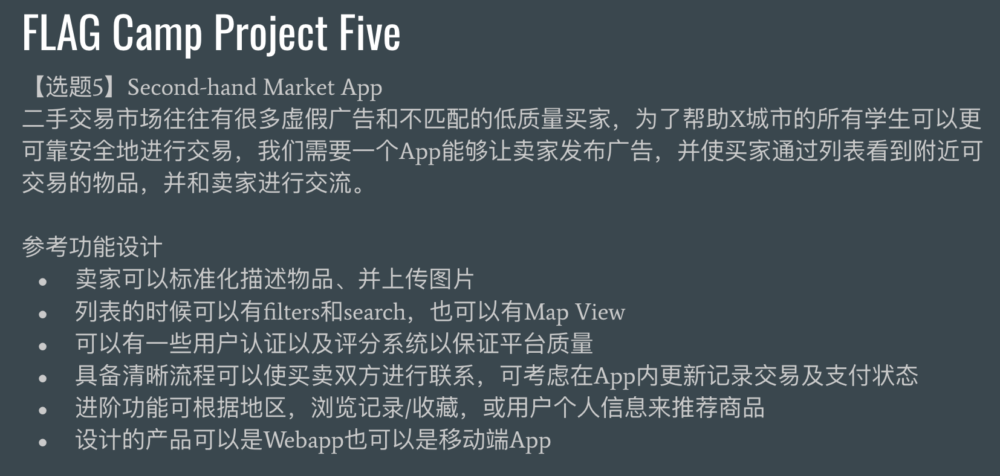
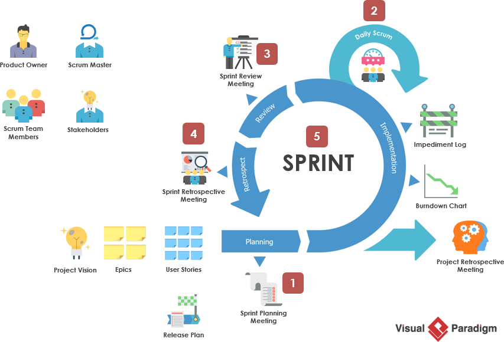
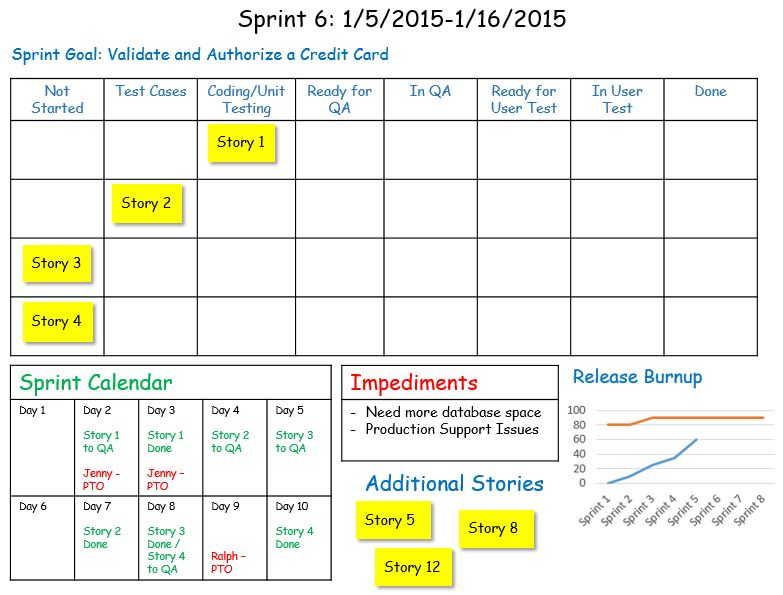

# Summary
主题：First Meeting

时间：周四(11/12)美西时间 16:00 - 17:00

目标：
1. 自我介绍，知道每个人都有什么经验
2. 确定Design Doc: [[link]](https://docs.google.com/document/d/1-DcBUM5C133_LKRSqJHfKrMgn_DZwZKon8JT4nnUrpM/edit?usp=sharing)

   * MVP: 部分 User Story / Use Case / User Journey
   * MVP: Themes & Features
   * MVP: 确定 tech stack 

3. 确定Agile的工作style

    * Product Owner (PO): 

    	* 目标：确保产品是customer要的产品

    	* 工作内容
    	```
    	keeps track of changing requirements
    	updates user story & backlog 
    	```

    * Scrum Master:

    	* 目标：维持组内高效的工作环境，帮助组员获得成功
    	* 工作内容：
   		```
   		1. 是组员和PO的沟通桥梁，分配任务以确保没有组员的工作过于多 / 少
   		2. 组员有技术问题可以refer给能提供帮助的人
   		3. 确保PO的目标适中
   		4. daily track组员的状态
   		5. 适度push
   		```
4. 提取 MVP Backlog，上下流分组。
5. 确定每个人领取接下来一周的工作:
	* 1 / 2 week sprint?
	* daily stand up + excel 1 sentence check in
6. 同步更新GitHub Repository
	* team
	* projects
7. 答疑

# Reference
## Topic


## Scrum Events


## Tracker tends to use


